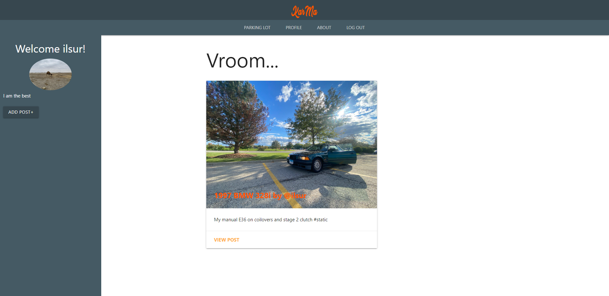
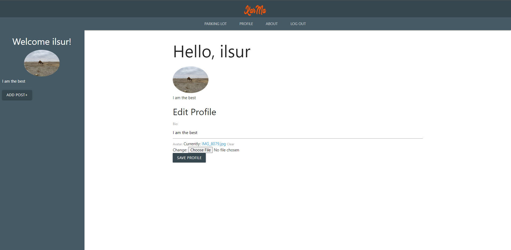

# KarMa!

## **Welcome to KarMa** ##

This is a social media app where people who like cars can post own cars as well as browse other peoples posts. I love cars especiallys the ones made in the 90 and was happy building this application with django! Enjoy!

## Table of Contents
* [Technologies Used](#technologiesused)
* [Features](#features)
* [Screenshots](#screenshots)
* [Deployed App](#deployment)
* [Future Plans](#futureplans)

## Technologies Used
* Python
* Django
* PostgreSQL
* HTML
* CSS
* Materialize CSS
* Heroku
* AWS

## Features
* Visitors can set up their own account to be a user
* Users can post their posts as well as edit and delete
* Users have the ability to edit their user profile with a profile picture and bio

## Screenshots

## Deployed App
* [Deployed link](https://karmasite.herokuapp.com/)

## Deployed App
* Would Like to add a Like button feature
* Would like to add a Garage for each profile where Users can add their own or favorite cars to be rendered on their profile page
* Add the ability for others users to browse other users profiles to see their garage and leave likes
